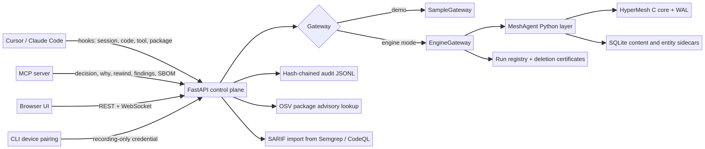
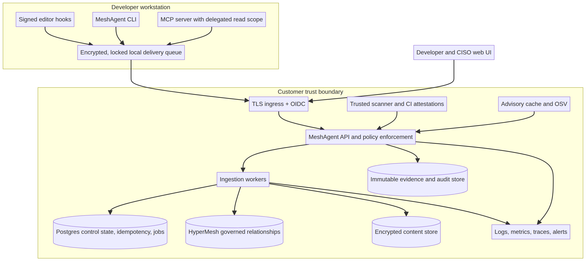

# MeshAgent Codebase Assessment and Productization Roadmap

**Author:** Manus AI  
**Assessment basis:** Uploaded `meshagent-app.zip`, including its current uncommitted working tree  
**Assessment date:** 23 September 2026

## Executive verdict

MeshAgent is **not merely a UI mockup**. It is an advanced prototype with a meaningful end-to-end product foundation: a React application, a FastAPI control plane, a HyperMesh-backed governed-memory engine, developer integrations for Cursor and Claude Code, an MCP interface, device pairing, package gating, provenance, temporal rewind, security findings, supply-chain records, deletion previews, and deletion certificates.[1] [2] [3] [5]

However, it is **not ready for an external enterprise pilot in its shipped configuration**. Its current maturity is approximately **2.4 out of 5**, best described as **advanced prototype / pre-pilot stabilization**. The largest blockers are not visual polish. They are secure deployment defaults, cross-store transaction integrity, adapter packaging and authentication, audit trust, release automation, backup and recovery, and ambiguity between the current application and older handoff documents.

The strongest product strategy is to make MeshAgent the **governance and evidence control plane for coding agents that companies already use**. Version 1 should not try to become another autonomous coding agent, a general-purpose RAG platform, a shared multi-tenant SaaS, and a 3D graph product at the same time. The existing code is strongest when it observes Cursor or Claude Code, captures what changed and why, checks packages before installation, preserves evidence, and gives security teams a fleet-level view.

> **Recommended product definition:** MeshAgent is a self-hosted governance layer for enterprise coding agents. It records agent activity and decisions, verifies software and security evidence, exposes traceable relationships, and supports controlled removal of compromised memory without requiring source code or agent memory to leave the customer boundary.

## 1. What I understand the product to be

MeshAgent serves two primary users.

**Maya, the developer**, continues working in Cursor or Claude Code. Repository-level hooks create a governed session from her first prompt, capture file contents after agent edits, record shell activity, and detect exact package versions in supported install commands. An MCP tool lets the agent state a decision and explicitly name the files that decision explains. A pre-command package gate can ask the MeshAgent API whether an exact dependency version should be allowed, warned, blocked, or treated as unknown.[8] [9] [10] [31]

**Priya, the security analyst**, sees the estate across developers. She can review active runs, coverage gaps, reachable findings, software packages, structural coupling, recommendations, device registrations, and the audit trail. She can inspect why a graph entity exists, reconstruct what a run knew at a past moment, preview what a removal would affect, and receive a deletion certificate after an approved removal.[2] [3] [5]

The central product idea is stronger than a normal activity log. MeshAgent treats one memory or evidence fact as an **n-ary relationship** that can connect a source, decision, code element, package, weakness, agent, and evidence item together. Pairwise edges remain useful for drawing and traversal, but the `Relation` contract preserves the original multi-member fact.[13]

### What is actually ingested today

The product does ingest package and code details while a developer works with coding agents, but with important limits:

| Signal | Current behavior | Important limit |
|---|---|---|
| First user prompt | Opens a governed session and records the task | Later prompts are not modeled as sources or decisions |
| File edits | Reads the current file from disk and sends the text | Files over 200 KB, excluded files, binary files, and unreadable files are skipped |
| Agent rationale | MCP `record_decision` records a reason and maps it to named modules | This is voluntary; the product intentionally does not infer rationale |
| Shell activity | Records the executed command as a tool event | Command capture can contain sensitive arguments unless policy/redaction is added |
| Package installs | Detects supported install commands and records exact pinned versions | It uses shell-token heuristics, not lockfile or package-manager resolution; transitive dependencies are not reliably captured |
| Package policy | Queries OSV and license policy before supported installs | Unpinned versions and feed outages become `unknown`; adapters intentionally fail open unless policy explicitly blocks |
| Security evidence | Imports SARIF and preserves reachability claims | SARIF is currently accepted as a broad dictionary without trusted CI attestation or bounded schema validation |
| Code analysis | Stores all text and decomposes valid Python code | Other languages are stored but not structurally decomposed by this path |

This means the current product can credibly say **“we observed this edit, this exact package installation, this explicit rationale, and this scanner result.”** It cannot yet claim complete dependency discovery, complete language analysis, or complete agent reasoning capture.

## 2. Current architecture

The architectural seam is well chosen. UI code calls FastAPI; FastAPI calls a `Gateway`; the gateway selects curated sample behavior or the real engine. The frontend is not coupled directly to HyperMesh, and graph rendering is separated from the graph contract.[1] [4] [13]

### Current technology map

| Layer | Current implementation | Assessment |
|---|---|---|
| Web application | React 18, TypeScript, Vite, TanStack Router and Query, Tailwind, Cytoscape, SVG hypergraph view | Broad functional surface, but no frontend tests and incomplete responsive/error behavior |
| API | FastAPI, Pydantic, REST, WebSocket, OIDC support, role and run ownership checks | Strong application-level foundation; unsafe defaults and missing abuse controls block production |
| Governed memory | Python MeshAgent layer over HyperMesh native core with SQLite sidecars | Real temporal/provenance behavior; cross-store operations are not atomic |
| Native storage | C library, WAL, temporal/member indexes, compaction, migration utility | Meaningful durability engineering; default tests and packaging are not portable |
| Developer integration | Cursor and Claude Code hooks, MCP server, pairing CLI | Thoughtful protocol; installation, remote endpoint, state isolation, and MCP read authentication are incomplete |
| Security data | OSV lookups, package policy, SARIF ingestion, built-in reachability | Useful foundation; scanner provenance and input limits need hardening |
| Deployment | Single-tenant Docker Compose with one persistent volume | Appropriate initial topology, but insecure and operationally incomplete as shipped |
| Operations | One Semgrep workflow, local audit file, basic health response | No release gate, telemetry, backup, restore, support, or disaster-recovery program |

## 3. What is genuinely strong

### The product has a coherent enterprise wedge

The developer and security-office journeys are understandable and connected. The developer produces evidence as a side effect of normal coding work. The analyst receives coverage, risk, provenance, and action views. This is more defensible than requiring developers to maintain a separate compliance record manually.[2] [8] [9]

### The system tries not to invent evidence

Several design choices are unusually disciplined. A hook that sees a file change does not pretend it knows why the change happened. An unpinned package is not assigned a guessed version. An unscanned finding is reported as **not assessed**, not safe. A forgotten memory can appear in a historical reconstruction only as deleted and redacted. These choices support the product’s trust claim.[5] [8] [9] [10]

### Identity and authorization primitives are substantive

When OpenID Connect is configured, token verification checks asymmetric signatures, issuer, expiry, subject, and optionally audience. Developers can read their own runs and explicitly seeded reference data. Analysts can read fleet-wide views. Device tokens are high-entropy, stored server-side only as hashes, revocable, and restricted to recorder and package-gate operations.[3] [6] [7]

### Forgetting is the most mature workflow

The UI obtains a read-only preview, displays the affected memory, submits the preview’s version, and handles stale state. The engine removes the root and its derivation closure, retains hashes rather than payloads, persists a deletion certificate, and redacts forgotten content from historical rewind.[3] [5] [17]

### The engine is real, not simulated

The repository contains a C core with a write-ahead log, temporal/member indexing, compaction, recovery tests, and Python bindings. The API’s engine mode can seed, write, reopen, query, rewind, and forget genuine HyperMesh records.[1] [5] [17]

### Automated API coverage is substantial

After building the native library and running with the correct Python path, the API suite completed with **403 tests passed, 1 skipped, and 1 deprecation warning**. The suite covers identity, device tokens, adapter translation, API routes, provenance, deletion, durability, reachability, and engine behavior.

## 4. Current maturity scorecard

| Product area | Score | Interpretation |
|---|---:|---|
| Product concept and user value | 6.5 / 10 | A credible differentiated wedge exists |
| Frontend product experience | 5.7 / 10 | Broad and thoughtful, but not release-protected or fully resilient |
| API, identity, and authorization | 5.0 / 10 | Good internal controls, unsafe deployment defaults |
| Hypergraph engine and governed storage | 5.6 / 10 | Real technical substance, unresolved atomicity and scale limits |
| Agent integrations and daily workflow | 4.2 / 10 | Protocol is promising; deployment and credential paths are incomplete |
| Enterprise operations and release readiness | 3.5 / 10 | Main reason the product is not pilot-ready |
| **Overall** | **4.8 / 10** | **Advanced prototype / pre-pilot stabilization** |

## 5. Verified build and test findings

I validated the uploaded working tree rather than relying only on documentation.

| Check | Result | Meaning |
|---|---|---|
| TypeScript typecheck | **Passed** for web, graph, and UI workspaces | Current frontend types are coherent |
| Web production build | **Passed** | Vite produced a deployable bundle |
| Web bundle | 1.366 MB JavaScript, 386 KB gzip | Code splitting should be addressed before broad deployment |
| Frontend lint | **Failed before linting** because `eslint` is not installed in workspace dependencies | The declared quality gate is not reproducible |
| Frontend tests | **None found** | UI behavior, accessibility, auth, destructive actions, and graph interactions are unprotected |
| API tests | **403 passed, 1 skipped** | Strong backend regression base after native library build |
| Engine-mode API smoke test | **Passed** | Health reported `EngineGateway`, durable storage, and a live fleet response |
| Native write test | **28 passed** | Core write behavior has direct coverage |
| Native WAL test | **Passed** | Recovery behavior has meaningful coverage |
| Native compaction test | **18 passed** | Large compaction path has coverage |
| Native parser test | **117 passed, 2 failed** | Qualified `ORDER BY` parsing is currently inconsistent |
| Native V2 test | **34 passed, 3 failed** | Migration assertions fail because a developer-specific absolute path is embedded |
| Default native smoke test | **Could not run** | The referenced drone-swarm CSV fixture is absent from the repository layout |
| Docker runtime build | Not executed in this environment | Docker was unavailable; Dockerfile and Compose were inspected statically |

The ZIP also contains a Git working tree with approximately **40 modified, deleted, or untracked paths** relative to commit `f44c323`. It includes generated databases under `var/`, Python bytecode, built web output, two tracked native binaries, and a second standalone `meshagent-security-workbench` application. This is useful development evidence but should not be the basis of a clean release artifact.

## 6. Highest-priority gaps

### 6.1 The shipped deployment is insecure by default

Docker Compose enables the real engine and publishes the API port, but it does not configure OpenID Connect. In that state, the API intentionally accepts `X-MeshAgent-User` and `X-MeshAgent-Role` headers for local development. A network client can therefore assert the analyst role and reach fleet, audit, recommendation, and destructive functions.[6] [22]

The frontend’s PKCE flow also generates an OAuth `state` value but does not persist and validate it on callback. This leaves the sign-in callback without the expected correlation check.

**Required response:** create explicit development, test, and production modes. Production startup must fail unless issuer, audience, analyst-group mapping, durable storage, approved origins, and secure ingress settings are present. The raw API should not be directly exposed over plaintext HTTP.

### 6.2 Governed-memory operations are not atomic across all stores

A governed memory spans the HyperMesh graph, a SQLite content sidecar, an entity registry, derivation edges, the run registry, and sometimes a deletion certificate. These components commit separately. A crash between steps can leave payload without graph identity, graph state without redaction, a partially forgotten closure, or a certificate inconsistent with durable state.[5] [16] [17]

**Required response:** add a persisted unit-of-work or outbox protocol. A forget operation should have prepared, applying, committed, and certified states. Startup recovery must either complete or roll back an interrupted operation, and fault-injection tests must cover every boundary.

### 6.3 The developer integration is not deployable end to end

The protocol design is strong, but the packaged journey is broken in important places:

- The API Docker image copies the API and engine but not the CLI or adapters. Its generated checkout path is invalid for the container filesystem.
- `meshagent login` stores the selected API endpoint, but the hooks do not consume that stored endpoint. Unless the editor inherits `MESHAGENT_API`, it defaults to `localhost:8000` and silently queues failed delivery.
- The MCP server reuses the device credential. That credential is correctly restricted to writes and package checks, so the documented `why`, `rewind`, `findings`, and `sbom` MCP reads are rejected by the API.
- Queue and session files are global under `~/.meshagent` and lack robust cross-process locking, repository namespacing, bounds, and recovery tooling.[3] [8] [9] [10] [11]

**Required response:** ship a versioned CLI and adapter distribution, persist endpoint configuration that hooks actually use, add `meshagent doctor/status/replay`, create an appropriate human or delegated read credential for MCP, and validate supported editor integrations with real subprocess-to-API tests.

### 6.4 Audit evidence is useful but not enterprise-grade

The audit file is appended, flushed, fsynced, and hash-chained. That detects simple edits in the middle of the log. It is not independently trustworthy because a privileged writer can recompute the whole chain. Multiple writers also lack a cross-process ordering mechanism. Most seriously, the route layer suppresses audit write errors by default, which allows a destructive action to succeed without a durable audit event.[3] [15]

A second defect is that a recommendation-triggered deletion does not pass the authenticated analyst into the engine certificate path. The route audit names the analyst, while the deletion certificate can say `unattributed`.[3] [5]

**Required response:** make audit persistence part of the success condition for protected mutations, pass authenticated actors into every certificate, serialize writers, and checkpoint signed chain heads to an external immutable store or security-event platform.

### 6.5 Product execution semantics are ambiguous

The main call to action is to run a task. When no model is configured, the engine stores the requested task but records and streams a fixed reference build. The code labels the run as a reference build, which is honest, but the user action can still imply that MeshAgent performed the requested coding work.[5]

**Required response:** expose three explicit modes before creation: **record an external agent**, **reference demonstration**, and **model-backed execution**. Do not label the latter two with the same action.

### 6.6 The repository contains two incompatible product contracts

The current application uses `apps/web`, React 18, TanStack Router, unversioned `/api` routes, and the FastAPI models in the monorepo. Older files describe a separate `client/` tree, React 19/Wouter/Zod, and tenant-oriented `/api/v1` endpoints. Those files are not harmless historical notes because they are written as implementation instructions.[12] [28] [29] [30]

No separate current “MeshAgent phased plan” document was found in the ZIP, uploads, or project files. The only explicit five-phase sequence is in the legacy Cursor backend guide; the current README contains only a short unowned backlog.[1] [30]

**Required response:** declare the current monorepo and one generated OpenAPI contract authoritative. Move legacy materials under `docs/archive/` with a clear banner or update them. If a separate phased-plan document exists elsewhere, attach it for a line-by-line reconciliation.

### 6.7 RAG does not yet inherit the governed-memory safety model

The engine has a `RecallGate` that can filter quarantined memory. The RAG path retrieves generic graph edges and constructs context without carrying the full governed-memory origin, status, source, or stable memory identifier. Generated citation-like tags are extracted from model output but are not strictly validated against the exact retrieved records.[18] [19] [20] [21]

**Required response:** route RAG candidates through the recall gate, use stable ULIDs as citations, reject citations outside the retrieved set, and keep quarantined content out of model context. Model keys and harvested prompts/contexts also need secret management, encryption, access controls, and retention rules.

### 6.8 Operations are not ready for a customer environment

The repository lacks a blocking CI pipeline, tested backups, restore automation, disaster recovery, OpenTelemetry, SLOs, alerting, migration and rollback runbooks, a support model, a security policy, a license, third-party notices, SBOM publication, artifact signing, and a release lifecycle. The only workflow runs Semgrep and allows that scan step to continue on error.[23]

The current Compose volume co-locates memory, device state, registry data, certificates, and the audit log. A volume is persistence, not a backup strategy.[22]

### 6.9 The frontend’s central graph claim needs correction

`GraphPayload` correctly distinguishes pairwise drawing edges from authoritative n-ary relations. The Cytoscape transform ignores `relations`, while the fleet screen labels the result a hypergraph. That can cause an analyst to infer incorrect fact boundaries or blast radius.[13] [14]

The UI also has no automated test suite, weak mobile behavior, inconsistent error-to-empty-state handling, and inconsistent confirmation for recommendation application and device revocation. The forget workflow is the model the other high-impact actions should follow.[2] [12]

### 6.10 Scale and tenant boundaries are not decided

The current design is explicitly single-tenant. That is a reasonable first product. It should remain a hard deployment boundary until tenant identity exists in the token, API context, storage keys, audit keys, encryption keys, and every query. Owner filtering alone is not multi-tenant isolation.[6] [17] [22]

Engine access is serialized through one process-wide lock because the native library is not safe for concurrent use. This protects correctness but limits throughput and does not coordinate multiple API workers. Several temporal and current-state paths scan broadly under that lock.[5]

## 7. Recommended Version 1 scope

The most credible Version 1 is a **single-tenant, self-hosted coding-agent governance appliance**.

### Include in Version 1

1. Supported Cursor and Claude Code integrations with a packaged installer and health diagnostics.
2. Explicit opt-in and exclusion rules at repository level.
3. Verified developer identity and recording-only device credentials.
4. Session, code, tool, exact resolved dependency, and explicit decision capture.
5. Package policy with recorded allow, warn, block, and unknown outcomes.
6. Trusted SARIF ingestion tied to repository, commit, scanner identity, and run.
7. Developer provenance, rewind, security, supply-chain, and removal-preview views.
8. CISO fleet coverage, risk, relationship, recommendation, device, and audit views.
9. Durable deletion with authenticated approval, idempotency, legal-hold checks, and externally verifiable evidence.
10. One documented deployment boundary inside the customer network.

### Defer from Version 1

1. A built-in autonomous coding agent. Integrate with existing agents first.
2. Shared multi-tenant SaaS. Build a secure appliance before a shared control plane.
3. General-purpose RAG. Enable only after recall policy and citation enforcement are complete.
4. Full 3D visualization. A truthful, accessible 2D relationship explorer is more valuable initially.
5. Native structural analysis for every language. Store all supported text, then add language analyzers based on pilot demand.
6. Automatic remediation across repositories. Start with recommendations, approvals, and exported work items.

This scope reduces execution risk while preserving the differentiator: evidence-aware governance of agent-created software.

## 8. Target architecture for the full product

The key change is that the API becomes a **transaction coordinator and policy boundary**, not only a synchronous wrapper over a process-local engine. Postgres should hold control-plane state, durable idempotency, operation state, tenant or appliance identity, and background-job metadata. HyperMesh remains the relationship engine. Content and immutable evidence require explicit encryption, retention, and backup semantics.

## 9. Phased product plan

The time ranges below are sequencing guidance, not delivery commitments. Actual duration depends on team size, the native-engine ownership model, and enterprise requirements.

### Phase 0: Containment and source-of-truth reset, weeks 0–4

**Objective:** make it impossible to mistake development behavior for production behavior.

Deliverables should include explicit runtime profiles, fail-closed production startup, required OIDC audience and analyst mapping, TLS ingress guidance, OIDC callback state validation, authenticated actor propagation to every deletion certificate, and fail-closed audit behavior for destructive operations. The product must distinguish record-only, reference demonstration, and model-backed execution.

The team should declare `apps/web`, `services/api`, and `services/engine` the source of truth, choose an API versioning policy, and archive or reconcile the legacy Workbench documents. The Docker setup path and adapter distribution defect should be fixed immediately.

**Exit criteria:** the current Compose configuration is rejected as a production profile; analyst-role spoofing is impossible in production; every deletion certificate names the actor; reference replay cannot appear as requested-task execution; and one approved product contract exists.

### Phase 1: Reproducible release candidate, months 1–3

**Objective:** create a clean build, test, packaging, and recovery baseline.

Build a blocking CI pipeline that runs frontend typechecking, lint, unit and component tests, Playwright journeys, accessibility checks, API sample and engine suites, native tests, migration tests, container builds, dependency and image scanning, license checks, and SBOM generation. Repair the native test fixture, parser failures, migration path, and Docker native build. Build the C library in a pinned multi-stage image instead of copying tracked binaries.

Publish signed CLI and adapter artifacts. Make endpoint configuration persistent. Add repository/editor/session-scoped locking and idempotency to the local queue, plus `doctor`, `status`, and `replay` commands. Implement a valid delegated or interactive credential path for MCP reads.

Add request sizes, field limits, scanner limits, rate limits, WebSocket limits, pagination, and storage quotas. Implement encrypted full-state backup and restore tests.

**Exit criteria:** a clean checkout produces signed images and integration artifacts; required CI is green; supported engine tests do not skip; live end-to-end tests prove pairing, hooks, MCP, persistence, revocation, remote API use, and replay; and a clean restore preserves memory, devices, registry, audit, and certificates.

### Phase 2: Integrity and pilot readiness, months 3–5

**Objective:** make the core governance claims defensible under crashes and adversarial inputs.

Implement a persisted unit-of-work and recovery protocol across graph, content, derivation, registry, audit, and certificate state. Make deletion resumable and durably idempotent. Add fault injection around every write boundary.

Make protected audit writes transactional, externally checkpoint or sign the audit chain, and forward records to immutable retention. Integrate recall policy with RAG, use stable citations, and reject fabricated citations. Secure model configuration and training data.

Correct graph semantics, add evidence drill-down and an accessible data alternative, standardize error and offline states, add WebSocket recovery, and complete responsive workflows. Add structured logs, metrics, traces, dashboards, readiness checks, and provisional service-level objectives.

**Exit criteria:** crash tests cannot produce false certificates or partial erasure; audit failure blocks protected actions; quarantined memory never reaches a model; fabricated citations fail validation; core workflows pass accessibility and performance budgets; and operators can diagnose identity, storage, audit, ingestion, and stream failures.

### Phase 3: Controlled design-partner pilot, months 5–8

**Objective:** validate value and operability in a tightly bounded customer deployment.

Deploy isolated single-tenant instances for two or three design partners. Use verified identity, encrypted durable storage, signed builds, trusted scanner attestations, backups, and staffed support. Publish the current API and generated TypeScript client. Run penetration testing and production-readiness review.

Measure recording success, delivery lag, coverage, unexplained code, package-gate decisions, unassessed findings, deletion completion, audit integrity, and user comprehension of execution modes.

**Exit criteria:** each partner operates for 30–60 days without an unresolved critical integrity or security incident; restore and upgrade drills pass; at least 95 percent of opted-in supported editor events are acknowledged within the agreed latency target; and every destructive action has authenticated authorization, durable idempotency, and independently verifiable evidence.

### Phase 4: Enterprise general availability, months 8–12

**Objective:** deliver a supportable product with explicit scale, compliance, and lifecycle commitments.

Implement the chosen scale model. For an appliance, use per-store engine workers and indexed reads. For shared hosting, add tenant identity, tenant-scoped storage, encryption keys, audit partitions, and query enforcement before onboarding any second customer to the same control plane.

Add enterprise federation and scoped authorization based on confirmed buyer needs. Move concurrent metadata and idempotency state to the approved durable store. Implement retention, legal hold, dual approval, lifecycle policies, signed releases, vulnerability response, support commitments, compatibility documentation, and end-of-life policy.

**Exit criteria:** an independent security review has no open critical or high findings; service objectives are met for 90 days under representative load; backup, failover, upgrade, and rollback exercises pass; artifacts are reproducible and signed; and product, security, operations, and legal owners approve the deployment, retention, deletion, and support model.

## 10. Release gates that should become non-negotiable

A release should not be considered pilot-ready unless all of the following are true:

1. **Production identity:** no asserted local role, no issuer without audience, no sample gateway, no ephemeral storage, and no public plaintext API.
2. **Data integrity:** injected crashes either leave a complete committed operation or an automatically recoverable one. There is no partial forget and no false certificate.
3. **Audit integrity:** protected actions fail when audit evidence cannot commit; all certificates name an authenticated actor; an external signed checkpoint verifies the chain.
4. **Integration:** Cursor, Claude Code, CLI, MCP, remote endpoint configuration, queue replay, revocation, and restart are tested as live processes against engine mode.
5. **Quality:** frontend, API, native, migration, contract, accessibility, visual, and end-to-end tests pass from a clean checkout.
6. **Supply chain:** dependencies and image digests are locked; releases include SBOM, license inventory, vulnerability results, provenance, and signatures.
7. **Recovery:** an encrypted backup restores the complete state within the declared recovery point and recovery time objectives.
8. **Abuse resistance:** payload, SARIF, rate, connection, graph-size, and storage limits are enforced and load-tested.
9. **Product truth:** sample, reference, record-only, model-backed, verified identity, and graph projection states are explicit and tested.
10. **Operations:** readiness checks, telemetry, alerts, runbooks, on-call ownership, and support escalation are in place.

## 11. Immediate 30-day engineering sequence

The first month should focus on risk reduction rather than new screens.

**Week 1:** freeze the contract. Select the current monorepo as source of truth, archive legacy documents, create an architecture decision record, and define development versus production profiles. Fix the OIDC state flow and require audience validation.

**Week 2:** secure destructive operations. Pass the actor through recommendation deletion, require preview version and durable idempotency for human deletion, make protected audit failures block the action, and add regression tests.

**Week 3:** repair adoption. Package the CLI and adapters, fix container setup paths, persist the API endpoint, implement MCP read authentication, namespace and lock local state, and add a diagnostic command.

**Week 4:** establish the release baseline. Add required CI, restore the missing native fixture, remove hard-coded migration paths, add ESLint dependencies, create first frontend tests, and build the native library inside the container image.

At the end of 30 days, MeshAgent should be a **secure and reproducible internal alpha**. It should not yet be marketed as enterprise-ready until cross-store atomicity, external audit trust, backup/restore, telemetry, and fault testing are complete.

## 12. Product and architecture decisions still required

The following decisions materially change the design and should be resolved before Phase 2:

1. Is MeshAgent permanently a single-tenant customer appliance, or will it become a shared multi-tenant service?
2. Is built-in model execution a core product, or should MeshAgent remain agent-neutral governance infrastructure?
3. Is RAG in the first pilot, or should it remain disabled until recall and citation controls are complete?
4. Which API contract becomes Version 1, and will the TypeScript client be generated from FastAPI OpenAPI?
5. What deletion promise is being sold: logical redaction, physical purge, cryptographic erasure, legal-hold-aware deletion, or dual-control deletion?
6. Which compliance regime determines audit retention, signing, export, and evidence immutability?
7. Which editor versions, operating systems, languages, package managers, and scanners are officially supported?
8. What are the pilot targets for graph size, concurrent agents, event throughput, latency, availability, and recovery?
9. Does Postgres hold only control-plane metadata, or also coordinate governed-memory transactions?
10. Which enterprise identity features are buyer requirements: OpenID Connect, SAML, SCIM, group mapping, scopes, step-up authentication, or dual approval?

## Final recommendation

Proceed with the product, but narrow the first commercial promise.

MeshAgent already contains the hardest conceptual pieces: a credible developer-side capture protocol, honest provenance semantics, a governed memory model, temporal reconstruction, deletion evidence, and a useful security-office workflow. The next investment should not be more visualization or another feature family. It should be **trustworthiness and adoption**: secure deployment, atomic evidence, dependable adapters, release engineering, backup and recovery, and a single authoritative product contract.

If those gaps are addressed in the sequence above, the codebase can evolve into a differentiated enterprise product. Without them, a polished UI would conceal a system that cannot yet defend its strongest claims under production failure, adversarial use, or customer audit.

## References

[1]: README.md "MeshAgent repository README"
[2]: apps/web/src/router.tsx "Current web application route tree"
[3]: services/api/app/main.py "FastAPI routes, authorization, audit calls, and WebSocket behavior"
[4]: services/api/app/gateway.py "Gateway interface and sample-versus-engine selection"
[5]: services/api/app/engine_gateway.py "Real HyperMesh engine gateway"
[6]: services/api/app/auth.py "OIDC and local-development identity implementation"
[7]: services/api/app/devices.py "Device pairing, token storage, scope, and revocation"
[8]: adapters/cursor/meshagent_hook.py "Cursor recording and package-gate adapter"
[9]: adapters/claude-code/meshagent_hook.py "Claude Code recording and package-gate adapter"
[10]: adapters/mcp/meshagent_mcp.py "MeshAgent MCP server and agent tools"
[11]: cli/meshagent.py "MeshAgent device-pairing CLI"
[12]: apps/web/src/lib/api.ts "Current frontend API client and wire interfaces"
[13]: packages/graph/src/types.ts "Renderer-independent graph and relation contract"
[14]: packages/graph/src/cytoscape.ts "Pairwise Cytoscape transformation"
[15]: services/api/app/audit.py "Hash-chained local audit log"
[16]: services/api/app/registry.py "Run and certificate registry persistence"
[17]: services/engine/hypermeshdb/agentmem/store.py "Governed-memory store and temporal operations"
[18]: services/engine/hypermeshdb/agentmem/gate.py "Write and recall policy gates"
[19]: services/engine/hypermeshdb/rag/retriever.py "RAG retrieval implementation"
[20]: services/engine/hypermeshdb/rag/context.py "RAG context construction"
[21]: services/engine/hypermeshdb/rag/generator.py "RAG generation and citation extraction"
[22]: docker-compose.yml "Current single-tenant Docker Compose deployment"
[23]: .github/workflows/semgrep-to-meshagent.yml "Current continuous-integration workflow"
[24]: package.json "Root workspace scripts and package metadata"
[25]: apps/web/package.json "Web application dependencies and scripts"
[26]: services/engine/hypermesh_core/Makefile "Native HyperMesh build and test targets"
[27]: services/api/tests/test_engine_gateway.py "Engine gateway behavior tests"
[28]: MeshAgent%20Security%20Workbench.md "Legacy frontend handoff document"
[29]: API_CONTRACT.openapi.yaml "Legacy API v1 contract"
[30]: Cursor%20Backend%20Integration%20Guide.md "Legacy backend integration phases"
[31]: services/api/app/gate.py "Package-advisory and license policy gate"
