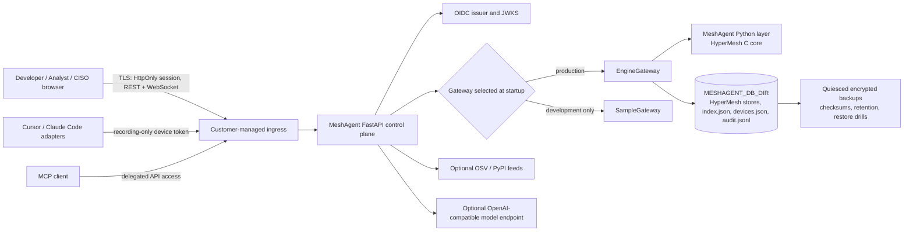

# MeshAgent Production v1

MeshAgent is a **single-tenant, customer-operated control plane for governed agent memory**. It records governed-memory relationships, provenance, security and package observations, and deletion certificates; a React web application exposes Developer, Analyst, and CISO journeys through a FastAPI API. This README is the authoritative description of the shipped v1 architecture and supported modes. Operational procedures are in [Production Operations](docs/PRODUCTION_OPERATIONS.md), security reporting is in [SECURITY.md](SECURITY.md), and support boundaries are in [SUPPORT.md](SUPPORT.md).

> MeshAgent v1 is software, not an attestation. It does not by itself establish regulatory compliance, immutable audit evidence, availability guarantees, complete vulnerability coverage, or deletion of every copy of data. Deployments must validate controls in their own environment.

## Authoritative architecture



The authoritative runtime components are listed below. The tree may include historical material, development helpers, and editor adapters; those do not override this architecture.

| Component                    | Location                             | Responsibility                                                                                                                                                    | Production boundary                                                                                              |
| ---------------------------- | ------------------------------------ | ----------------------------------------------------------------------------------------------------------------------------------------------------------------- | ---------------------------------------------------------------------------------------------------------------- |
| Web application              | `apps/web`                           | Browser UI, role landing, unified Analyst operations and collaboration, and CISO governance                                                                        | Served behind a customer-managed TLS ingress. It never stores OIDC tokens and is not an authorization authority. |
| API control plane            | `services/api/app`                   | BFF OIDC/PKCE, opaque sessions, REST/WebSocket authorization, workflow state, device pairing, audit logging, gateway selection                                    | Enforce exact origins, identity configuration, and one writer per state directory.                               |
| Engine gateway               | `services/api/app/engine_gateway.py` | Production-facing gateway over governed HyperMesh memory                                                                                                          | Required for production. Serializes engine access in the current process.                                        |
| MeshAgent / HyperMesh engine | `services/engine`                    | Governed-memory records, provenance, forget, and graph export primitives                                                                                          | State remains in `MESHAGENT_DB_DIR`; test concurrency and storage behavior for the chosen platform.              |
| Durable state                | `MESHAGENT_DB_DIR`                   | HyperMesh directories, run registry, operation journal, `control-plane.sqlite3`, `developer-sessions.sqlite3`, `browser_sessions.sqlite3`, devices, and audit log | Must be persistent, access-controlled, single-writer, and backed up as one unit.                                 |
| Operations package           | `scripts/ops`                        | Quiesced backup, manifest verification, pluggable encryption, clean restore, retention, drill, upgrade preflight, and rollback handoff                            | Deployment hooks supply service-manager, KMS, and isolated health-check behavior.                                |

The API exposes unauthenticated `GET /api/health` so callers can identify the active gateway, durability, and identity-provider status. A healthy response indicates the configured process is reachable; it does not prove that all business, security, or disaster-recovery controls are effective.

## Supported operating modes

| Mode                              | Start condition                                                 | State and identity behavior                                                                                | Appropriate use                                                 |
| --------------------------------- | --------------------------------------------------------------- | ---------------------------------------------------------------------------------------------------------- | --------------------------------------------------------------- |
| **Local sample mode**             | Default API configuration                                       | Uses `SampleGateway`; no production persistence claim; local asserted identity may be used                 | UI development and demonstrations only.                         |
| **Engine development mode**       | `MESHAGENT_ENGINE=1`                                            | Uses real engine records; `MESHAGENT_DB_DIR` makes state survive restart                                   | Integration testing and operator rehearsal. Use isolated state. |
| **Production single-tenant mode** | Engine mode, durable state, OIDC, TLS ingress, verified backups | `EngineGateway`; customer-controlled state; API-owned opaque browser sessions; controlled recorder devices | Supported v1 deployment mode.                                   |

**Do not deploy sample mode, an unset `MESHAGENT_DB_DIR`, or local asserted identity as production.** Production is intentionally a customer-network deployment. This repository does not ship a multi-tenant service, managed KMS, external audit signing, HA topology, or a complete observability stack.

## Quick start for local development

### Prerequisites

- Node.js 20+ with pnpm 9 (`corepack enable`)
- Python 3.12+
- A build environment appropriate for the bundled engine if the supplied artifact is not suitable for your platform

Run the API and web application in separate terminals:

```bash
# Terminal 1: API in sample mode
cd services/api
python -m venv .venv
source .venv/bin/activate
pip install -r requirements.txt
uvicorn app.main:app --reload --port 8000
```

```bash
# Terminal 2: web application
corepack enable
pnpm install
pnpm dev:web
```

Open the Vite URL (normally `http://localhost:5173`). The API health check is at `http://localhost:8000/api/health`; FastAPI documentation is at `http://localhost:8000/docs`.

To exercise real engine persistence in an isolated development directory:

```bash
# From the repository root; choose an empty directory outside any production state.
export MESHAGENT_ENGINE=1
export MESHAGENT_DB_DIR="$PWD/.local/meshagent-state"
cd services/api
PYTHONPATH=../engine uvicorn app.main:app --reload --port 8000
```

The service uses a temporary directory when `MESHAGENT_DB_DIR` is unset. That behavior is intentional for tests but must not be relied upon for persistent work.

## Local containers

The included Compose configuration is a convenience for local single-host use:

```bash
docker compose up --build
```

It publishes the web application at `http://localhost:8080` and the API at `http://localhost:8000`, with a named Docker volume mounted at `/var/lib/meshagent`. Before treating a container deployment as production, add the external TLS ingress, OIDC configuration, persistent storage controls, backup hooks, retention, monitoring, and change control described in the operations runbook. Do not expose the provided local ports directly to untrusted networks.

## Production baseline

1. Set `MESHAGENT_ENGINE=1` and mount a dedicated persistent `MESHAGENT_DB_DIR`.
2. Configure the OIDC issuer, API audience, public browser client ID, scopes, role claim, and distinct Analyst and CISO group mappings. The API performs Authorization Code + PKCE, verifies the resulting access token, and keeps it behind an opaque HttpOnly session. Once an issuer is configured, the API rejects development identity headers. Overlapping privileged groups fail startup and ambiguous signed claims fail authentication. Rebuild the web image after changing public OIDC settings.
3. Place the service behind TLS, restrict network routes, set exact `MESHAGENT_CORS_ORIGINS`, and configure `MESHAGENT_WEB_URL` to the canonical browser origin.
4. Provision quiesce and resume hooks, encrypted backup recipients, controlled recovery identities, and a legal-hold register.
5. Verify an encrypted backup and conduct an isolated application recovery drill before acceptance and at the approved cadence.
6. Implement the observability plan and release controls in [Production Operations](docs/PRODUCTION_OPERATIONS.md).

See the [secure deployment configuration matrix](docs/PRODUCTION_OPERATIONS.md#2-secure-deployment-configuration-matrix) and [operational command reference](docs/PRODUCTION_OPERATIONS.md#10-operational-command-reference) for complete procedures.

The hardened single-host Compose baseline requires explicit identity and browser origins:

```bash
export MESHAGENT_OIDC_ISSUER=https://identity.example.com/tenant/v2.0
export MESHAGENT_OIDC_AUDIENCE=meshagent-api
export MESHAGENT_OIDC_CLIENT_ID=meshagent-web
export MESHAGENT_ANALYST_GROUPS=meshagent-security
export MESHAGENT_CISO_GROUPS=meshagent-ciso
export MESHAGENT_CORS_ORIGINS=https://meshagent.example.com
export MESHAGENT_WEB_URL=https://meshagent.example.com
docker compose -f docker-compose.production.yml --profile production up --build -d
```

The API remains internal to the Compose network; the web container is the only published service. Terminate TLS at a customer-managed ingress before the published web port.

## API and data-handling notes

- **Identity and authority:** With OIDC enabled, the API owns discovery, PKCE, code exchange, token verification, opaque HttpOnly browser sessions, session expiry/revocation, CSRF origin checks, and WebSocket session checks. It maps signed groups into one closed primary role: Developer, Analyst, or CISO. Developers see their own non-seeded runs. Analysts receive investigative and case capabilities. CISOs receive policy, approval, remediation, report, and fleet-device capabilities. Verified Bearer clients remain supported; the API remains the enforcement point.
- **Workflow state:** `control-plane.sqlite3` stores cases, immutable case events, policy aggregates and immutable versions, policy lifecycle events, exact-version exceptions, exception events, approvals, remediation work, reports, and posture snapshots. Policy and exception mutations use aggregate optimistic concurrency; exception approvals bind to the exact policy digest and request digest submitted for decision. This database must be backed up with the HyperMesh stores, registry, devices, operation journal, and audit log.
- **Connected-agent sessions:** `developer-sessions.sqlite3` stores owner-scoped Cursor and Claude Code sessions, ordered activity, replay state, projection status, and package-policy evaluations. The API commits these events before ordered HyperMesh projection and automatically retries transient projection failures. Python code produces native module-to-package import and function-to-package-API invocation relations; policy activity produces native OSV advisory, source, fix, and policy relations. Local adapter queues preserve accepted records in order and expose backpressure instead of silently truncating them. See the [Developer Session Backend](docs/DEVELOPER_SESSION_BACKEND.md) for the exact schema and wire contract.
- **Developer session workspace:** The Developer role lands on an icon-led, repository-scoped Sessions workspace rather than the demo task runner. A compact non-IDE shell provides global Sessions, Attention, and Connections navigation; session-local Overview, Activity, Security, and Evidence views expose ordered activity, package-policy decisions, projection health, and the governed HyperMesh handoff through visual flows and contextual drawers. Attention shows only actionable package checks, CVEs, published fix releases, and code directly linked by graph evidence or recorded imports. A Developer can ask Security for a safe version, guidance, temporary approval, or false-positive review; the Analyst receives an immutable prioritized request, cannot alter the submitted evidence, and records an auditable decision. A later clean package check closes a remediation request automatically. Connections unifies editor setup, repository opt-in, privacy exclusions, devices, and API-backed verification. The demo runner remains behind a development-tools menu.
- **Analyst operations:** `/analyst/queue` combines Developer review requests and investigation cases in one server-ranked workspace with search, filters, personal saved views, assignment and due times, overdue state, optimistic bulk triage, and review-to-case escalation. Durable team notes, mentions, per-person notifications, and `/analyst/activity` keep handoffs attached to the source work. Selecting a native evidence node supplies exact package, advisory, code, contributor, or decision context for escalation. Analysts and CISOs can operate across the tenant; Developers are denied these operations endpoints. The initial single-tenant queue reads a bounded working set of 100 cases and 500 reviews before filtering; add database-level keyset pagination before relying on it for larger inventories. See [Analyst Operations and Collaboration](docs/ANALYST_OPERATIONS.md).
- **CISO governance enforcement and evidence:** Policies retain immutable versions, exact content digests, effective intervals, and append-only events. In production, a second CISO must activate every submitted revision. Exception requests bind the active policy version, evidence, owner, controls, and expiry into one request digest; the requester cannot approve, renew, or revoke that request. Renewal creates a new approval-bound record and supersedes the predecessor only after approval. A service-owned reconciler materializes approval and exception expiry, survives restart without duplicate events, and delivers durable role-scoped notifications. Policy and exception events now enter a transactional projection outbox and become digest-verified native HyperMesh relations with retry-safe ULID acknowledgement and capability-scoped evidence APIs. See the [Priority 5A Technical Design](docs/PRIORITY5A_GOVERNANCE_CONTRACTS.md), [Priority 5B Enforcement Design](docs/PRIORITY5B_GOVERNANCE_ENFORCEMENT.md), [Priority 5C Native Evidence Design](docs/PRIORITY5C_NATIVE_GOVERNANCE_EVIDENCE.md), and [Priority 5 Project Plan](docs/PRIORITY5_PROJECT_PLAN.md).
- **Role-scoped relationship maps:** Review creation freezes native HyperMesh entity IDs and a canonical evidence digest. Request, decision, and automatic-verification events are projected from a transactional outbox as append-only HyperMesh episodes with stable ULIDs. Developers can inspect the native evidence ancestry for their own review request only. Analysts and CISOs can inspect the submitted cross-role evidence needed to decide that request; unrelated prompts, files, and sessions are excluded. Fleet-wide graph access remains a Security-office capability.
- **Devices:** Paired device credentials can use recording routes but are refused on human-only routes. Revoke devices that are lost, retired, or suspicious.
- **Audit:** `audit.jsonl` is append-only and hash chained. Verification can detect a broken chain but is not an externally signed or immutable log. Preserve the audit file and the registry in backups.
- **Deletion:** `forget` removes governed-memory content and returns a deletion certificate. Backups, replicas, exported material, and third-party systems require separate records, retention, and legal-hold procedures.
- **Model and feed egress:** Model use and advisory feeds are optional. Enabling them changes the deployment's external data flows and must be approved by the deployment owner.

## Validation

The authoritative release gate validates the locked frontend, complete API suite, native engine tests, production Compose substitutions, and optional container builds:

```bash
scripts/release/validate.sh
```

Set `SKIP_CONTAINERS=1` only on a workstation without Docker; CI must run the container build jobs.

Before a release or an operational change, additionally follow the [release checklist](CHANGELOG.md#release-checklist), verify a real backup, and run the appropriate recovery or rollback rehearsal.

## Document authority and archived material

The following documents control production v1 operations and policy:

- [README.md](README.md): architecture and supported modes.
- [docs/PRODUCTION_OPERATIONS.md](docs/PRODUCTION_OPERATIONS.md): operations, recovery, observability, retention, and deployment matrix.
- [docs/ANALYST_OPERATIONS.md](docs/ANALYST_OPERATIONS.md): Priority 4 queue, assignment, escalation, collaboration, notification, and scaling contract.
- [docs/PRIORITY5A_GOVERNANCE_CONTRACTS.md](docs/PRIORITY5A_GOVERNANCE_CONTRACTS.md): durable policy versions, exception evidence binding, events, migrations, and APIs.
- [docs/PRIORITY5B_GOVERNANCE_ENFORCEMENT.md](docs/PRIORITY5B_GOVERNANCE_ENFORCEMENT.md): maker-checker activation, exception renewal/revocation, materialized expiry, reconciler operations, and notification rules.
- [docs/PRIORITY5C_NATIVE_GOVERNANCE_EVIDENCE.md](docs/PRIORITY5C_NATIVE_GOVERNANCE_EVIDENCE.md): transactional governance projection, native relation vocabulary, digest verification, scoped retrieval, and recovery behavior.
- [docs/PRIORITY5_PROJECT_PLAN.md](docs/PRIORITY5_PROJECT_PLAN.md): staged Priority 5A–5E scope, dependencies, acceptance criteria, and timeline.
- [SECURITY.md](SECURITY.md): private security disclosure process.
- [SUPPORT.md](SUPPORT.md): support boundary and issue-routing guidance.
- [CHANGELOG.md](CHANGELOG.md): release checklist and change record.

Documents in [`docs/archive/`](docs/archive/) are **archived, historical, and non-authoritative**. They may describe an earlier prototype, an obsolete API shape, or a handoff context. Do not implement or operate against them without reconciling the content with the authoritative documents above.

## License and notices

See [LICENSE](LICENSE) and [NOTICE](NOTICE). The repository has not made an independent claim about licenses of every transitive dependency or deployment artifact; maintain a release-specific dependency inventory and legal review appropriate to your distribution model.

## Getting help and reporting vulnerabilities

For operational and product support, use [SUPPORT.md](SUPPORT.md). Do not open a public issue for a suspected vulnerability; follow [SECURITY.md](SECURITY.md).
