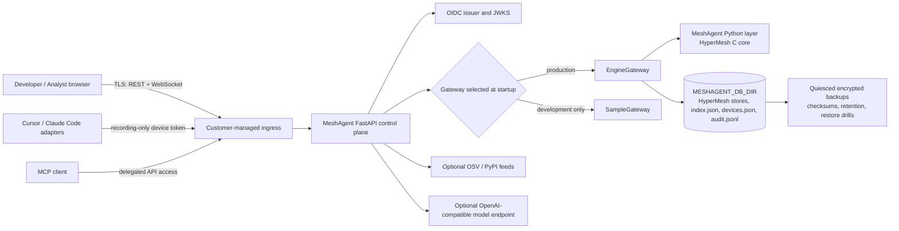

# MeshAgent Production v1

MeshAgent is a **single-tenant, customer-operated control plane for governed agent memory**. It records governed-memory relationships, provenance, security and package observations, and deletion certificates; a React web application exposes developer and analyst workflows through a FastAPI API. This README is the authoritative description of the shipped v1 architecture and supported modes. Operational procedures are in [Production Operations](docs/PRODUCTION_OPERATIONS.md), security reporting is in [SECURITY.md](SECURITY.md), and support boundaries are in [SUPPORT.md](SUPPORT.md).

> MeshAgent v1 is software, not an attestation. It does not by itself establish regulatory compliance, immutable audit evidence, availability guarantees, complete vulnerability coverage, or deletion of every copy of data. Deployments must validate controls in their own environment.

## Authoritative architecture



The authoritative runtime components are listed below. The tree may include historical material, development helpers, and editor adapters; those do not override this architecture.

| Component | Location | Responsibility | Production boundary |
|---|---|---|---|
| Web application | `apps/web` | Browser user interface and API client | Served behind a customer-managed TLS ingress. It is not an authorization authority. |
| API control plane | `services/api/app` | REST/WebSocket endpoints, OIDC verification, device pairing, audit logging, gateway selection | Enforce network controls, exact CORS origins, and identity configuration. |
| Engine gateway | `services/api/app/engine_gateway.py` | Production-facing gateway over governed HyperMesh memory | Required for production. Serializes engine access in the current process. |
| MeshAgent / HyperMesh engine | `services/engine` | Governed-memory records, provenance, forget, and graph export primitives | State remains in `MESHAGENT_DB_DIR`; test concurrency and storage behavior for the chosen platform. |
| Durable state | `MESHAGENT_DB_DIR` | HyperMesh directories (`run`, `fleet`, `run-*`), `index.json`, `devices.json`, `audit.jsonl` | Must be persistent, access-controlled, and backed up as one unit. |
| Operations package | `scripts/ops` | Quiesced backup, manifest verification, pluggable encryption, clean restore, retention, drill, upgrade preflight, and rollback handoff | Deployment hooks supply service-manager, KMS, and isolated health-check behavior. |

The API exposes unauthenticated `GET /api/health` so callers can identify the active gateway, durability, and identity-provider status. A healthy response indicates the configured process is reachable; it does not prove that all business, security, or disaster-recovery controls are effective.

## Supported operating modes

| Mode | Start condition | State and identity behavior | Appropriate use |
|---|---|---|---|
| **Local sample mode** | Default API configuration | Uses `SampleGateway`; no production persistence claim; local asserted identity may be used | UI development and demonstrations only. |
| **Engine development mode** | `MESHAGENT_ENGINE=1` | Uses real engine records; `MESHAGENT_DB_DIR` makes state survive restart | Integration testing and operator rehearsal. Use isolated state. |
| **Production single-tenant mode** | Engine mode, durable state, OIDC, TLS ingress, verified backups | `EngineGateway`; customer-controlled persistent state; OIDC access tokens; controlled recorder devices | Supported v1 deployment mode. |

**Do not deploy sample mode, an unset `MESHAGENT_DB_DIR`, or local asserted identity as production.** Production is intentionally a customer-network deployment. This repository does not ship a multi-tenant service, managed KMS, external audit signing, HA topology, or a complete observability stack.

## Quick start for local development

### Prerequisites

- Node.js 20+ with pnpm 9 (`corepack enable`)
- Python 3.12+
- A build environment appropriate for the bundled engine if the supplied artifact is not suitable for your platform

Run the API and web application in separate terminals:

```bash
# Terminal 1: API in sample mode
cd services/api
python -m venv .venv
source .venv/bin/activate
pip install -r requirements.txt
uvicorn app.main:app --reload --port 8000
```

```bash
# Terminal 2: web application
corepack enable
pnpm install
pnpm dev:web
```

Open the Vite URL (normally `http://localhost:5173`). The API health check is at `http://localhost:8000/api/health`; FastAPI documentation is at `http://localhost:8000/docs`.

To exercise real engine persistence in an isolated development directory:

```bash
# From the repository root; choose an empty directory outside any production state.
export MESHAGENT_ENGINE=1
export MESHAGENT_DB_DIR="$PWD/.local/meshagent-state"
cd services/api
PYTHONPATH=../engine uvicorn app.main:app --reload --port 8000
```

The service uses a temporary directory when `MESHAGENT_DB_DIR` is unset. That behavior is intentional for tests but must not be relied upon for persistent work.

## Local containers

The included Compose configuration is a convenience for local single-host use:

```bash
docker compose up --build
```

It publishes the web application at `http://localhost:8080` and the API at `http://localhost:8000`, with a named Docker volume mounted at `/var/lib/meshagent`. Before treating a container deployment as production, add the external TLS ingress, OIDC configuration, persistent storage controls, backup hooks, retention, monitoring, and change control described in the operations runbook. Do not expose the provided local ports directly to untrusted networks.

## Production baseline

1. Set `MESHAGENT_ENGINE=1` and mount a dedicated persistent `MESHAGENT_DB_DIR`.
2. Configure the OIDC issuer, API audience, public browser client ID, role claim, and analyst group mapping. Once an issuer is configured, the API rejects development identity headers. Rebuild the web image after changing browser OIDC settings.
3. Place the service behind TLS, restrict network routes, set exact `MESHAGENT_CORS_ORIGINS`, and configure `MESHAGENT_WEB_URL` to the canonical browser origin.
4. Provision quiesce and resume hooks, encrypted backup recipients, controlled recovery identities, and a legal-hold register.
5. Verify an encrypted backup and conduct an isolated application recovery drill before acceptance and at the approved cadence.
6. Implement the observability plan and release controls in [Production Operations](docs/PRODUCTION_OPERATIONS.md).

See the [secure deployment configuration matrix](docs/PRODUCTION_OPERATIONS.md#2-secure-deployment-configuration-matrix) and [operational command reference](docs/PRODUCTION_OPERATIONS.md#10-operational-command-reference) for complete procedures.

The hardened single-host Compose baseline requires explicit identity and browser origins:

```bash
export MESHAGENT_OIDC_ISSUER=https://identity.example.com/tenant/v2.0
export MESHAGENT_OIDC_AUDIENCE=meshagent-api
export MESHAGENT_OIDC_CLIENT_ID=meshagent-web
export MESHAGENT_ANALYST_GROUPS=meshagent-security
export MESHAGENT_CORS_ORIGINS=https://meshagent.example.com
export MESHAGENT_WEB_URL=https://meshagent.example.com
docker compose -f docker-compose.production.yml --profile production up --build -d
```

The API remains internal to the Compose network; the web container is the only published service. Terminate TLS at a customer-managed ingress before the published web port.

## API and data-handling notes

- **Identity:** With OIDC enabled, the API validates issuer, audience, expiry, and asymmetric signatures. Developers see their own non-seeded runs; analysts are selected from signed claim groups and can view fleet data. This is an application boundary that should be independently tested at deployment time.
- **Devices:** Paired device credentials can use recording routes but are refused on human-only routes. Revoke devices that are lost, retired, or suspicious.
- **Audit:** `audit.jsonl` is append-only and hash chained. Verification can detect a broken chain but is not an externally signed or immutable log. Preserve the audit file and the registry in backups.
- **Deletion:** `forget` removes governed-memory content and returns a deletion certificate. Backups, replicas, exported material, and third-party systems require separate records, retention, and legal-hold procedures.
- **Model and feed egress:** Model use and advisory feeds are optional. Enabling them changes the deployment's external data flows and must be approved by the deployment owner.

## Validation

The authoritative release gate validates the locked frontend, complete API suite, native engine tests, production Compose substitutions, and optional container builds:

```bash
scripts/release/validate.sh
```

Set `SKIP_CONTAINERS=1` only on a workstation without Docker; CI must run the container build jobs.

Before a release or an operational change, additionally follow the [release checklist](CHANGELOG.md#release-checklist), verify a real backup, and run the appropriate recovery or rollback rehearsal.

## Document authority and archived material

The following documents control production v1 operations and policy:

- [README.md](README.md): architecture and supported modes.
- [docs/PRODUCTION_OPERATIONS.md](docs/PRODUCTION_OPERATIONS.md): operations, recovery, observability, retention, and deployment matrix.
- [SECURITY.md](SECURITY.md): private security disclosure process.
- [SUPPORT.md](SUPPORT.md): support boundary and issue-routing guidance.
- [CHANGELOG.md](CHANGELOG.md): release checklist and change record.

Documents in [`docs/archive/`](docs/archive/) are **archived, historical, and non-authoritative**. They may describe an earlier prototype, an obsolete API shape, or a handoff context. Do not implement or operate against them without reconciling the content with the authoritative documents above.

## License and notices

See [LICENSE](LICENSE) and [NOTICE](NOTICE). The repository has not made an independent claim about licenses of every transitive dependency or deployment artifact; maintain a release-specific dependency inventory and legal review appropriate to your distribution model.

## Getting help and reporting vulnerabilities

For operational and product support, use [SUPPORT.md](SUPPORT.md). Do not open a public issue for a suspected vulnerability; follow [SECURITY.md](SECURITY.md).
