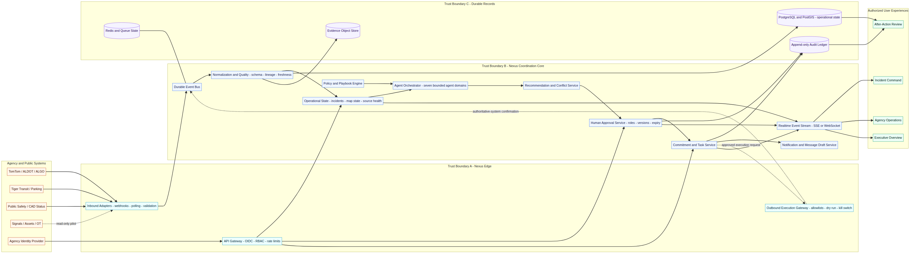

# Nexus Coordinate — Real-World Agency Architecture and API Design

**Scope:** Transition Nexus from a simulation-oriented MARL demonstration to a real-time, human-approved agency advisory platform, beginning with SEC Game Day mobility.  
**Stage 1 boundary:** Nexus may ingest authorized live evidence, create recommendations, obtain human decisions, create commitments, and record external execution confirmations. It does not directly operate traffic devices, dispatch systems, public-alert channels, or other operational technology.

## 1. Architecture Objectives

| Objective | Architectural consequence |
|---|---|
| **Human authority** | Recommendation, approval, tasking, execution request, and verification are separate state transitions with separate permissions. |
| **Evidence lineage** | Every normalized event retains its source, source event ID, received time, observed time, schema version, quality state, and immutable raw-payload reference. |
| **No in-memory authority** | A restart cannot erase an incident, approval, task, or audit event. Operational truth is durable; caches and live streams are disposable projections. |
| **Agency isolation** | Inbound read adapters and outbound execution adapters have separate credentials, network paths, scopes, and deployment controls. |
| **Live/training separation** | `live`, `training`, and `replay` are enforced at API, database, worker, and connector layers—not only by the UI. |
| **Graceful degradation** | A delayed source downgrades or blocks affected recommendations instead of turning missing data into false certainty. |

NIST describes transportation, physical monitoring, and related physical-world systems as operational technology with distinctive safety, reliability, and performance requirements. [1] CISA’s AI-in-OT guidance emphasizes careful risk management plus continuous monitoring, validation, and refinement. [2] These principles support an architecture in which agents cannot directly reach operational systems and human authority is independently enforced.

## 2. Logical Services

The pilot may begin as a modular monolith, but the responsibilities and data ownership below should be separated from the first implementation.

| Service | Responsibility | Owns | Must not own |
|---|---|---|---|
| **API Gateway and Identity** | Authenticate, authorize, rate-limit, and correlate requests | Sessions, client registrations, request context | Recommendation logic or execution credentials |
| **Integration Adapters** | Receive signed webhooks or poll authorized feeds; validate and retry | Connector cursors, source retry/dead-letter state | Human decisions |
| **Event Normalization and Quality** | Convert payloads to canonical evidence and calculate freshness/quality | Canonical events, schema versions, source quality | Operational approvals |
| **Operational State** | Build incidents, game phase, geospatial state, and source health | Incidents, locations, event plans, source status | Model weights or connector secrets |
| **Agent Orchestrator** | Run the seven bounded domain agents against an immutable incident snapshot | Agent findings and model/version metadata | Approval status or outbound calls |
| **Policy and Playbook Engine** | Apply emergency-route, ADA, ownership, evidence, expiry, and approval rules | Versioned policies, action templates, role requirements | User identity source |
| **Recommendation and Conflict Service** | Produce a bounded recommendation and expose incompatible findings | Recommendation versions, impacts, alternatives, evidence set | Approval authority |
| **Human Approval Service** | Enforce approver rules and record approve/reject/revise/delegate/escalate | Decisions, approver chain, expiry, signatures | Execution-adapter credentials |
| **Commitment and Task Service** | Turn an approved scope into cross-agency work and track completion | Tasks, assignments, acknowledgement, blockers, verification | Raw feeds |
| **Execution Gateway** | Translate approved, allowlisted requests into authoritative-system requests | Execution request, receipt, confirmation/rollback reference | Generic pass-through commands or recommendation generation |
| **Audit Ledger** | Append immutable user, service, policy, and connector events | Tamper-evident audit events | Mutable operational state |
| **Realtime Stream** | Publish role-filtered incident, decision, task, and source updates | Transient cursors/connections | Authoritative records |
| **After-Action Service** | Reconstruct timelines and pilot metrics | Approved reports, annotations, lessons learned | Live operational writes |

## 3. Canonical Domain Model

| Entity | Identity/version fields | Core content |
|---|---|---|
| **OperationalEvent** | `eventId`, `mode`, `eventType`, `startsAt`, `version` | Game plan, phase, participants, readiness state |
| **Source** | `sourceId`, `ownerAgencyId`, `schemaVersion` | Connector type, cadence, stale threshold, permitted use, status |
| **EvidenceEvent** | `evidenceId`, `sourceId`, `sourceEventId`, `observedAt`, `receivedAt`, `version` | Geometry, measurement/status, normalized fields, quality flags, raw reference |
| **Incident** | `incidentId`, `operationalEventId`, `status`, `severity`, `version` | Plain-language brief, location, commander, affected services, policy context |
| **AgentFinding** | `findingId`, `agentId`, `modelVersion`, `snapshotVersion` | Observation, interpretation, candidate response, confidence calibration, limitations |
| **Recommendation** | `recommendationId`, `incidentId`, `version`, `state` | What changed, why it matters, bounded action, expected effect, constraints, evidence |
| **ApprovalRequirement** | `requirementId`, `recommendationVersion` | Role, agency, quorum, order, deadline, delegation rule |
| **Decision** | `decisionId`, `recommendationVersion`, `actorId`, `decidedAt` | Approve/reject/revise/delegate/escalate, reason code, comment, authentication context |
| **Commitment** | `commitmentId`, `decisionId`, `state`, `version` | Requestor, owner, assignee, outcome, due time, blocker, verification rule |
| **ExecutionRequest** | `executionRequestId`, `commitmentId`, `actionTemplateId`, `version` | Connector, bounded parameters, dry run, authorizations, status, external receipt |
| **AuditEvent** | `auditId`, `sequence`, `actor`, `timestamp` | Object type/ID/version, action, before/after hash, request ID, mode, outcome |

All mutable entities use optimistic concurrency through a server-issued `version` or ETag. Every consequential write requires an `Idempotency-Key`; the API returns a conflict rather than silently overwriting a newer operational state.

## 4. Event-to-Execution Flow

| Step | System behavior | Safety boundary |
|---|---|---|
| **1. Ingest** | An adapter validates authenticity, stores an immutable raw payload, and emits canonical evidence. | No external payload directly changes operational state. |
| **2. Normalize** | Schema, quality, freshness, observed time, and geographic context are applied. | Invalid or duplicate source events are rejected/quarantined. |
| **3. Build incident** | The operational state service creates or updates a versioned incident projection. | Evidence requirements must be met before a decision is surfaced. |
| **4. Analyze** | Agents evaluate an immutable incident snapshot and return findings. | A finding is not an operational command. |
| **5. Apply policy** | Ownership, emergency access, ADA, source freshness, expiry, and allowed-action rules are evaluated. | Conflicts are shown, not hidden or automatically resolved. |
| **6. Recommend** | A bounded, plain-language recommendation with required approvers is created. | Recommendation state remains separate from authorization. |
| **7. Authorize** | A named human acknowledges and decides; the approval service records identity, role, evidence version, reason, and time. | Approval creates commitments but cannot bypass the execution boundary. |
| **8. Execute/confirm** | In Stage 1, an agency acts through its existing system and records a receipt/reference. A future gateway may invoke only an allowlisted template. | No generic command endpoint; authority is checked again at execution time. |
| **9. Verify** | A source or accountable operator confirms the outcome. | Green/complete state is reserved for verified execution. |
| **10. Audit/replay** | Every transition is appended to the audit ledger and emitted to authorized realtime clients. | Audit is immutable; replay cannot reach live connectors. |

## 5. Trust Boundaries

| Boundary | Allowed traffic | Required controls |
|---|---|---|
| **External systems → Nexus edge** | Signed webhook or outbound-only adapter fetch | Per-source credential, signature verification, replay protection, schema validation, rate limits, dead-letter handling |
| **Nexus edge → coordination core** | Canonical evidence and authenticated commands | Service identity, least-privilege scopes, mode enforcement, request correlation |
| **Core → durable stores** | Versioned operational records and immutable evidence/audit objects | Encryption, backups, retention, agency/role access, integrity controls |
| **Core → execution gateway** | Approved request referencing immutable decision and allowlisted template | Separate credentials, second authorization check, dry run, parameter validation, circuit breaker, kill switch |
| **Execution gateway → agency system** | Narrow agency/vendor operation or manual/deep-link handoff | Private connectivity where required, connector least privilege, authoritative receipt, no generic proxy |
| **Core → user experience** | Role-filtered REST and realtime events | OIDC, server-side authorization, field-level redaction, stream filtering |

CISA’s secure OT-connectivity guidance recommends intentionally designed and managed connectivity for essential-service environments. [3] The execution gateway is therefore an action-template boundary, not a generic HTTP proxy.

## 6. Mode Isolation

| Control plane | Live | Training | Replay |
|---|---|---|---|
| **Database namespace** | Production operational records | Synthetic/training records | Read-only historical/derived records |
| **Inputs** | Authorized live sources | Fixtures/training feeds | Recorded evidence stream |
| **Execution gateway** | Stage 1 manual/reference-only; future allowlisted controls | Disabled at policy and credential layer | Disabled at policy and credential layer |
| **Notifications** | Authorized operational recipients | Test recipients only | Disabled |
| **API scopes** | Live-operation scopes and event assignment | Training-only scopes | Read-only replay scopes |

The mode is stored on every operational event, incident, recommendation, decision, commitment, execution request, and audit record. The API rejects cross-mode references.

## 7. Persistence and Realtime Reliability

| Capability | Pilot design | Production-hardening path |
|---|---|---|
| **Operational data** | Managed PostgreSQL + PostGIS with migrations and point-in-time backup | Multi-zone configuration and tested recovery runbook |
| **Event delivery** | Durable queue/stream with retry and dead-letter handling | Partitioned bus and connector isolation |
| **Evidence objects** | Immutable object storage for raw payloads/attachments | Retention tiers, legal hold, integrity verification |
| **Cache/stream metadata** | Redis for locks, rate limits, stream cursors, and fan-out metadata | Managed HA cache; client resume using event IDs |
| **Audit** | Append-only table with object/version hashes | Immutable archive or dedicated tamper-evident ledger |
| **Frontend updates** | Authorized SSE stream for incident/decision/task/source changes | Multi-instance fan-out and resumable event cursors |

## 8. Deployment Approaches

| Approach | Tradeoffs | Cost | Setup complexity |
|---|---|---|---|
| **Expand the existing Railway application into a durable Stage 1 pilot** | Fastest path and preserves the current stack. Requires API/worker separation, durable database/queue/audit, recovery tests, and strict connector boundaries. Appropriate for supervised advisory operations, not proof of readiness for direct OT control. | Lower initial infrastructure cost; data/vendor access can add separate costs. | Moderate |
| **Agency-approved high-assurance integration environment** | Adds private connectivity, identity federation, dedicated gateways, formal availability/recovery, and eventual bounded controls. Slower and dependent on agency security/procurement. | Higher due to infrastructure, private networking, security review, connectors, and support. | High |

Stakeholders should select the pilot host after confirming data classification, identity, uptime, and procurement requirements. The domain model and adapter boundaries are intentionally portable across both approaches.

## 9. Required Security Controls

| Control | Requirement |
|---|---|
| **Authentication** | OIDC/OAuth2 for humans; client credentials or mutually authenticated service identity for connectors. |
| **Authorization** | Agency + role + scope + incident assignment + mode; enforced server-side for endpoints and stream events. |
| **Consequential writes** | Idempotency key, optimistic concurrency, request ID, current evidence version, reason code, policy evaluation, immutable audit event. |
| **Secrets** | Deployment secret manager only; connector credentials never appear in API responses or audit payloads. |
| **Data minimization** | Privacy-minimized public-safety incident status for the pilot, not unrestricted case data. |
| **Logging** | Structured correlated logs with sensitive-field redaction; diagnostic logs remain separate from operational audit. |
| **Kill switches** | Execution gateway and each connector can be disabled independently without disabling advisory access. |

## 10. Implementation Sequence

| Slice | Backend outcome | Enables |
|---|---|---|
| **1. Operational domain foundation** | PostgreSQL/PostGIS schema for events, sources, evidence, incidents, recommendations, decisions, commitments, and audit; mode isolation. | Live status rail and incident brief |
| **2. Evidence ingestion and source health** | Adapter framework, canonical schema, freshness policy, retry/dead-letter handling. | Real evidence and source-quality UI |
| **3. Recommendation and policy boundary** | Agent findings become versioned, bounded recommendations with constraints and approvers. | Live decision cards |
| **4. Human approval and commitments** | Role checks, idempotent decisions, state machine, audit, task creation, verification. | End-to-end advisory pilot |
| **5. Realtime and after-action** | Authorized SSE, resumable cursors, timeline, report generation. | Wall command center and replay |
| **6. Agency execution gateway** | Manual/deep-link connector first; approved action templates only if later justified. | Verified external execution without direct agent control |

## References

[1] [NIST SP 800-82 Rev. 3, “Guide to Operational Technology (OT) Security.”](https://csrc.nist.gov/pubs/sp/800/82/r3/final)  
[2] [CISA, “Principles for the Secure Integration of Artificial Intelligence in Operational Technology.”](https://www.cisa.gov/resources-tools/resources/principles-secure-integration-artificial-intelligence-operational-technology)  
[3] [CISA, “Secure Connectivity Principles for Operational Technology (OT).”](https://www.cisa.gov/resources-tools/resources/secure-connectivity-principles-operational-technology-ot)  
[4] [OpenAPI Initiative, “OpenAPI Specification v3.1.0.”](https://spec.openapis.org/oas/v3.1.0.html)
